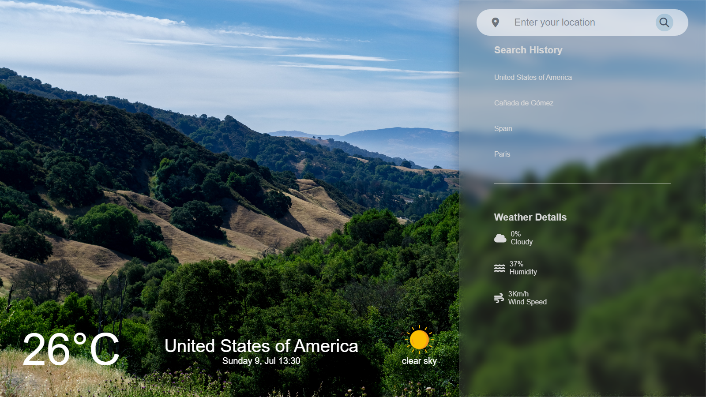

  

---

# Sunshine Weather

Sunshine Weather is an interactive web page that provides weather information for any location in the world. Users can easily search for a city or country and get real-time weather updates, including temperature, humidity, wind speed, and description. It has a simple and effective user interface, which includes a main weather display component, a sidebar with an entry to search for cities or countries, a search history section and another with detailed weather information.

## Features

- Get weather information for any location worldwide.
- User-friendly interface with intuitive design.
- Real-time weather updates.
- Search history to keep track of previous searches.
- Detailed weather information including temperature, humidity, wind speed, and description.
- Responsive design for a seamless experience on different devices.

## Technologies Used

- <a href="https://react.dev/" target="_blank">**React**</a>: A JavaScript library for building interactive user interfaces.
- <a href="https://www.typescriptlang.org/docs/" target="_blank">**TypeScript**</a>: A superset of JavaScript that adds static types and other features to the language syntax.
- <a href="https://sass-lang.com/documentation/" target="_blank">**Sass**</a>: A CSS preprocessor that provides additional features and a more readable syntax.
- <a href="https://axios-http.com/" target="_blank">**Axios**</a>: A popular library for making HTTP requests.
- <a href="https://openweathermap.org/api" target="_blank">**OpenWeatherMap API**</a>: A weather data API that provides current and forecast weather information.

## Project Structure

- `src/assets`: Contains static assets such as images and icons used in the application.
- `src/components`: Contains reusable components used in different parts of the application.
- `src/context`: Contains context providers and consumers used for state management.
- `src/models`: Contains TypeScript interfaces or types used for defining data structures.
- `src/services`: Contains the weather service responsible for fetching data from the OpenWeatherMap API.
- `src/styles`: Contains Sass style files for styling the application.

## HTML-CSS-JavaScript Version of the Project

<a href="https://github.com/MatiasGonta/sunshine-weather-html-css-js" target="_blank">See the HTML, CSS and JavaScript version</a>

## Authors

- Matías Gonta

If you have any questions, concerns or interest, feel free to contact me.

---

  

---

# Sunshine Weather

Sunshine Weather es una página web interactiva que proporciona información meteorológica para cualquier lugar del mundo. Los usuarios pueden buscar fácilmente una ciudad o un país y obtener actualizaciones meteorológicas en tiempo real, incluida la temperatura, la humedad, la velocidad del viento y la descripción. Tiene una interfaz de usuario simple y efectiva, que incluye un componente principal de visualización del clima, una barra lateral con una entrada para buscar ciudades o países, una sección de historial de búsqueda y otra con información detallada del clima.

## Características

- Obtener información meteorológica para cualquier lugar del mundo.
- Interfaz fácil de usar con un diseño intuitivo.
- Actualizaciones meteorológicas en tiempo real.
- Historial de búsqueda para realizar un seguimiento de las búsquedas anteriores.
- Información meteorológica detallada que incluye temperatura, humedad, velocidad del viento y descripción.
- Diseño responsive para una experiencia perfecta en diferentes dispositivos.

## Tecnologías utilizadas

- <a href="https://react.dev/" target="_blank">**React**</a>: Una biblioteca de JavaScript para crear interfaces de usuario interactivas.
- <a href="https://www.typescriptlang.org/docs/" target="_blank">**TypeScript**</a>: Un superconjunto de JavaScript que agrega tipos estáticos y otras funciones a la sintaxis del lenguaje .
- <a href="https://sass-lang.com/documentation/" target="_blank">**Sass**</a>: Un preprocesador de CSS que proporciona funciones adicionales y una sintaxis más legible.
- <a href="https://axios-http.com/" target="_blank">**Axios**</a>: Una biblioteca popular para realizar solicitudes HTTP.
- <a href="https://openweathermap.org/api" target="_blank">**OpenWeatherMap API**</a>: Una API de datos meteorológicos que proporciona información meteorológica actual y pronosticada.

## Estructura del proyecto

- `src/assets`: Contiene activos estáticos como imágenes e íconos utilizados en la aplicación.
- `src/components`: Contiene componentes reutilizables utilizados en diferentes partes de la aplicación.
- `src/context`: Contiene proveedores de contexto y consumidores utilizados para la gestión del estado.
- `src/models`: Contiene interfaces TypeScript o tipos utilizados para definir estructuras de datos.
- `src/services`: Contiene el servicio meteorológico responsable de obtener datos de la API de OpenWeatherMap.
- `src/styles`: Contiene archivos de estilo Sass para diseñar la aplicación.

## Versión HTML-CSS-JavaScript del proyecto

<a href="https://github.com/MatiasGonta/sunshine-weather-html-css-js" target="_blank">Ver la versión HTML, CSS y JavaScript</a>

## Autores

-Matias Gonta

Si tiene alguna pregunta, inquietud o interés, no dude en ponerse en contacto conmigo.
